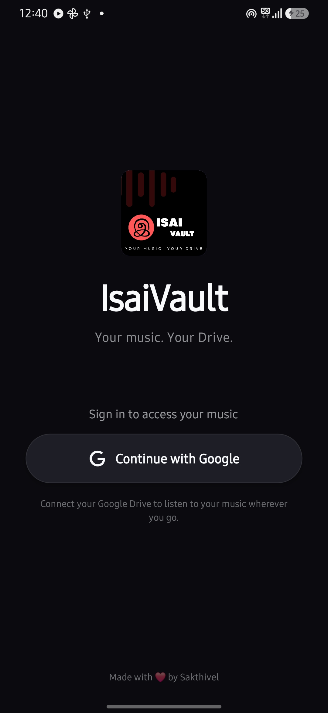
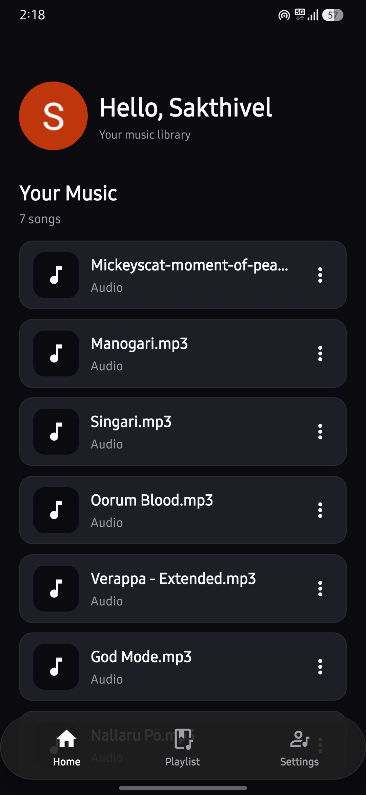
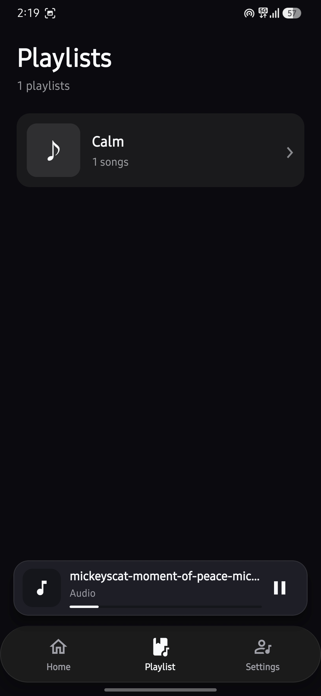
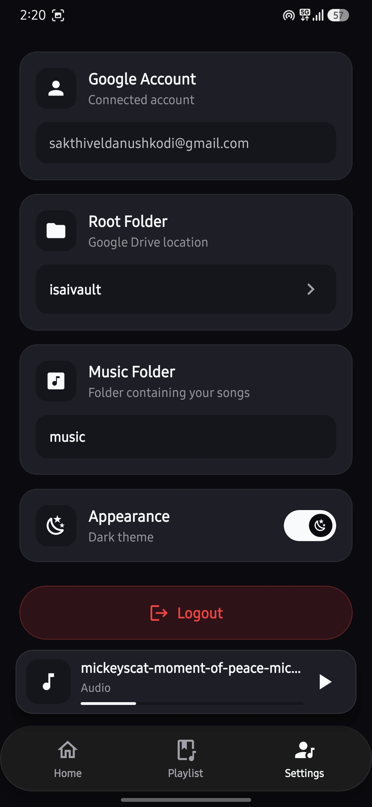

# IsaiVault

IsaiVault is a mobile music player that uses Google Drive to store and stream music. Users can connect their Google account, select a music folder from Google Drive, and play their music directly from the app.

<h2>Screenshots</h2>

<table>
  <tr>
    <td align="center">
      
    </td>
    <td align="center">
      
    </td>
    <td align="center">
      
    </td>
    <td align="center">
      
    </td>
  </tr>
</table>

## Features

- Google account authentication
- Browse music stored in Google Drive
- Stream music directly from Google Drive
- Music queue and playback controls
- Playlists
- Download music to the device
- Delete music from Google Drive
- Background music playback
- Lock-screen and notification controls
- Light and dark appearance
- Automatic Google session restoration

## Tech Stack

### Mobile App

- React Native
- Expo
- Expo Router
- Expo Audio

### Backend / APIs

- Google Sign-In
- Google Drive API

### Storage

- Google Drive for music files
- AsyncStorage for local app settings and preferences

## How It Works

1. Sign in with a Google account.
2. Select the Google Drive folder containing your music.
3. IsaiVault loads the available audio files.
4. Select a song to stream it directly from Google Drive.
5. Songs can be added to the queue or playlists.
6. Music can continue playing while the app is in the background.
7. Songs can also be downloaded to the device for local storage.

## Project Setup

### Requirements

- Node.js
- pnpm
- Android Studio
- Android SDK
- Java JDK
- A physical Android device or Android emulator

### Install Dependencies

```bash
pnpm install